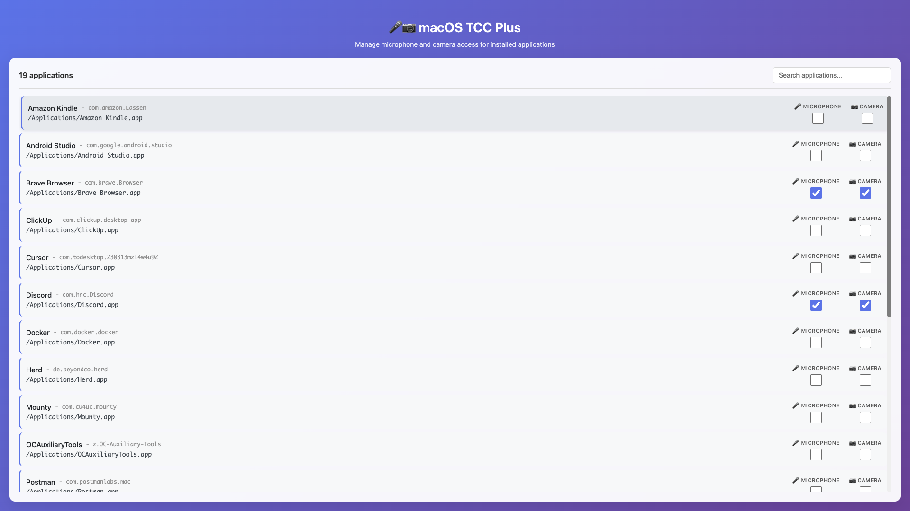

# macOS TCC Plus

A beautiful macOS desktop application to manage microphone and camera access permissions for installed applications. Easily view and control which apps have access to your microphone and camera.

## Features

- 🎨 **Modern UI** - Beautiful gradient design with smooth animations
- 📱 **Complete App List** - Lists all installed applications from `/Applications` and `~/Applications`
- 🎤 **Microphone Management** - View and toggle microphone access for any app
- 📷 **Camera Management** - View and toggle camera access for any app
- ✅ **Visual Status** - Checkboxes clearly show current permission state
- 🔍 **Search & Filter** - Quickly find apps with real-time search
- 📋 **Bundle ID Display** - See app bundle IDs for technical reference
- ⚡ **Fast & Responsive** - Instant permission updates

## Requirements

- macOS 10.13 or later
- Full Disk Access permission (required to read TCC database)

## Download & Installation

### Latest Release: v0.0.1

Download the appropriate version for your Mac:

- **Apple Silicon (M1/M2/M3)**: [macOS TCC Plus-1.0.0-arm64.dmg](https://github.com/yourusername/macos-tccplus/releases/download/v0.0.1/macOS-TCC-Plus-1.0.0-arm64.dmg)
- **Intel (x86_64)**: [macOS TCC Plus-1.0.0.dmg](https://github.com/yourusername/macos-tccplus/releases/download/v0.0.1/macOS-TCC-Plus-1.0.0.dmg)

### Installation Steps

1. **Download the DMG file** for your Mac architecture (see links above)

2. **Open the DMG file** by double-clicking it

3. **Drag the app** to your Applications folder

4. **First Launch**:
   - If you see a security warning, right-click the app and select **Open**
   - Or go to **System Settings → Privacy & Security** and click **Open Anyway**

5. **Grant Full Disk Access** (Required):
   - Open **System Settings → Privacy & Security → Full Disk Access**
   - Click the **+** button and add **macOS TCC Plus**
   - Check the box next to the app
   - Restart the app if it's running

6. **You're ready!** The app will now show all installed applications and their permission status.

## How to Use

### Viewing Permissions

1. Launch **macOS TCC Plus** from your Applications folder
2. Browse the list of installed applications
3. Check the checkboxes on the right:
   - 🎤 **Microphone** - Shows if the app has microphone access
   - 📷 **Camera** - Shows if the app has camera access

### Granting Permissions

1. Find the app you want to grant permissions to
2. Click the checkbox for **Microphone** or **Camera**
3. Confirm the dialog
4. The permission will be granted immediately

### Revoking Permissions

1. Find the app with the permission you want to revoke
2. Uncheck the **Microphone** or **Camera** checkbox
3. Confirm the dialog
4. The permission will be revoked immediately

### Searching Apps

- Use the search box at the top to filter apps by name or path
- Search is case-insensitive and works in real-time

### Copying App Path

- Click on any app name or path to copy it to your clipboard
- Useful for technical reference or troubleshooting

## Important Notes

### System Permissions

⚠️ **Full Disk Access Required**: 
- The app needs Full Disk Access to read the TCC (Transparency, Consent, and Control) database
- Without this permission, the app cannot check or modify permissions
- This is a macOS security requirement

### Security

🔒 **Use with Caution**: 
- Modifying TCC permissions affects system security
- Only grant permissions to trusted applications
- Revoking permissions may break app functionality that requires camera/microphone access

### Compatibility

- Works on macOS 10.13 (High Sierra) and later
- Supports both Intel (x86_64) and Apple Silicon (arm64) Macs
- Some system apps may not appear in the list (by design)

## Troubleshooting

### App won't show permissions

- **Solution**: Make sure you've granted Full Disk Access in System Settings

### Permission changes not taking effect

- **Solution**: Wait a few seconds and refresh the app, or restart the target application

### App shows "loading..." indefinitely

- **Solution**: Check that Full Disk Access is granted and restart the app

### Can't find an app

- Some system apps are hidden by design
- Try searching for the app name
- Check both `/Applications` and `~/Applications` folders manually

## How It Works

macOS TCC Plus uses the macOS TCC (Transparency, Consent, and Control) system to:

1. **Read the TCC database** to check current permissions
2. **Query installed applications** from system directories
3. **Use tccplus** to programmatically grant or revoke permissions
4. **Display real-time status** with visual checkboxes

The app provides a user-friendly interface for managing permissions that would otherwise require terminal commands or System Settings navigation.

## Privacy

- The app only reads TCC permission data
- No data is sent to external servers
- All operations are performed locally on your Mac
- Source code is available for review

## License

MIT License - Feel free to use, modify, and distribute

## Contributing

Contributions are welcome! Please feel free to submit a Pull Request.

## Support

For issues, questions, or feature requests, please open an issue on GitHub.

---

**Made with ❤️ for macOS users**
